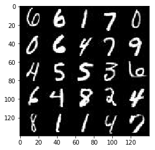
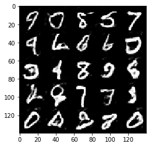
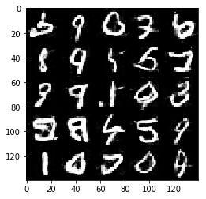
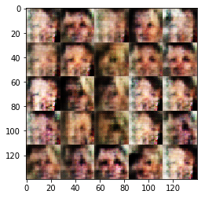
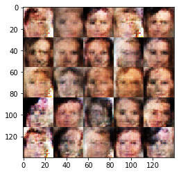

# Face Generation
In this project, you'll use generative adversarial networks to generate new images of faces.
### Get the Data
You'll be using two datasets in this project:
- MNIST
- CelebA

Since the celebA dataset is complex and you're doing GANs in a project for the first time, we want you to test your neural network on MNIST before CelebA.  Running the GANs on MNIST will allow you to see how well your model trains sooner.

If you're using [FloydHub](https://www.floydhub.com/), set `data_dir` to "/input" and use the [FloydHub data ID](http://docs.floydhub.com/home/using_datasets/) "R5KrjnANiKVhLWAkpXhNBe".


```python
data_dir = '/data'
!pip install matplotlib==2.0.2
# FloydHub - Use with data ID "R5KrjnANiKVhLWAkpXhNBe"
#data_dir = '/input'


"""
DON'T MODIFY ANYTHING IN THIS CELL
"""
import helper

helper.download_extract('mnist', data_dir)
helper.download_extract('celeba', data_dir)
```

    Requirement already satisfied: matplotlib==2.0.2 in /opt/conda/lib/python3.6/site-packages
    Requirement already satisfied: python-dateutil in /opt/conda/lib/python3.6/site-packages (from matplotlib==2.0.2)
    Requirement already satisfied: pyparsing!=2.0.0,!=2.0.4,!=2.1.2,!=2.1.6,>=1.5.6 in /opt/conda/lib/python3.6/site-packages (from matplotlib==2.0.2)
    Requirement already satisfied: six>=1.10 in /opt/conda/lib/python3.6/site-packages (from matplotlib==2.0.2)
    Requirement already satisfied: numpy>=1.7.1 in /opt/conda/lib/python3.6/site-packages (from matplotlib==2.0.2)
    Requirement already satisfied: cycler>=0.10 in /opt/conda/lib/python3.6/site-packages/cycler-0.10.0-py3.6.egg (from matplotlib==2.0.2)
    Requirement already satisfied: pytz in /opt/conda/lib/python3.6/site-packages (from matplotlib==2.0.2)
    You are using pip version 9.0.1, however version 18.1 is available.
    You should consider upgrading via the 'pip install --upgrade pip' command.
    Found mnist Data
    Found celeba Data


## Explore the Data
### MNIST
As you're aware, the [MNIST](http://yann.lecun.com/exdb/mnist/) dataset contains images of handwritten digits. You can view the first number of examples by changing `show_n_images`. 


```python
show_n_images = 25

"""
DON'T MODIFY ANYTHING IN THIS CELL
"""
%matplotlib inline
import os
from glob import glob
from matplotlib import pyplot

mnist_images = helper.get_batch(glob(os.path.join(data_dir, 'mnist/*.jpg'))[:show_n_images], 28, 28, 'L')
pyplot.imshow(helper.images_square_grid(mnist_images, 'L'), cmap='gray')
```


    <matplotlib.image.AxesImage at 0x7f07103ece10>





### CelebA
The [CelebFaces Attributes Dataset (CelebA)](http://mmlab.ie.cuhk.edu.hk/projects/CelebA.html) dataset contains over 200,000 celebrity images with annotations.  Since you're going to be generating faces, you won't need the annotations.  You can view the first number of examples by changing `show_n_images`.


```python
show_n_images = 25

"""
DON'T MODIFY ANYTHING IN THIS CELL
"""
mnist_images = helper.get_batch(glob(os.path.join(data_dir, 'img_align_celeba/*.jpg'))[:show_n_images], 28, 28, 'RGB')
pyplot.imshow(helper.images_square_grid(mnist_images, 'RGB'))
```


    <matplotlib.image.AxesImage at 0x7f071034e4e0>


## Preprocess the Data
Since the project's main focus is on building the GANs, we'll preprocess the data for you.  The values of the MNIST and CelebA dataset will be in the range of -0.5 to 0.5 of 28x28 dimensional images.  The CelebA images will be cropped to remove parts of the image that don't include a face, then resized down to 28x28.

The MNIST images are black and white images with a single [color channel](https://en.wikipedia.org/wiki/Channel_(digital_image%29) while the CelebA images have [3 color channels (RGB color channel)](https://en.wikipedia.org/wiki/Channel_(digital_image%29#RGB_Images).
## Build the Neural Network
You'll build the components necessary to build a GANs by implementing the following functions below:
- `model_inputs`
- `discriminator`
- `generator`
- `model_loss`
- `model_opt`
- `train`

### Check the Version of TensorFlow and Access to GPU
This will check to make sure you have the correct version of TensorFlow and access to a GPU


```python
"""
DON'T MODIFY ANYTHING IN THIS CELL
"""
from distutils.version import LooseVersion
import warnings
import tensorflow as tf

# Check TensorFlow Version
assert LooseVersion(tf.__version__) >= LooseVersion('1.0'), 'Please use TensorFlow version 1.0 or newer.  You are using {}'.format(tf.__version__)
print('TensorFlow Version: {}'.format(tf.__version__))

# Check for a GPU
if not tf.test.gpu_device_name():
    warnings.warn('No GPU found. Please use a GPU to train your neural network.')
else:
    print('Default GPU Device: {}'.format(tf.test.gpu_device_name()))
```

    TensorFlow Version: 1.3.0
    Default GPU Device: /gpu:0


### Input
Implement the `model_inputs` function to create TF Placeholders for the Neural Network. It should create the following placeholders:
- Real input images placeholder with rank 4 using `image_width`, `image_height`, and `image_channels`.
- Z input placeholder with rank 2 using `z_dim`.
- Learning rate placeholder with rank 0.

Return the placeholders in the following the tuple (tensor of real input images, tensor of z data)


```python
import problem_unittests as tests

def model_inputs(image_width, image_height, image_channels, z_dim):
    """
    Create the model inputs
    :param image_width: The input image width
    :param image_height: The input image height
    :param image_channels: The number of image channels
    :param z_dim: The dimension of Z
    :return: Tuple of (tensor of real input images, tensor of z data, learning rate)
    """
    # TODO: Implement Function
    inputs_real = tf.placeholder(tf.float32, (None, image_width,image_height,image_channels), name='inputs_real') 
    inputs_z = tf.placeholder(tf.float32, (None, z_dim), name='inputs_z')
    learning_rate = tf.placeholder(tf.float32)
    return inputs_real, inputs_z, learning_rate
    

"""
DON'T MODIFY ANYTHING IN THIS CELL THAT IS BELOW THIS LINE
"""
tests.test_model_inputs(model_inputs)
```

    ERROR:tensorflow:==================================
    Object was never used (type <class 'tensorflow.python.framework.ops.Operation'>):
    <tf.Operation 'assert_rank_2/Assert/Assert' type=Assert>
    If you want to mark it as used call its "mark_used()" method.
    It was originally created here:
    ['File "/opt/conda/lib/python3.6/runpy.py", line 193, in _run_module_as_main\n    "__main__", mod_spec)', 'File "/opt/conda/lib/python3.6/runpy.py", line 85, in _run_code\n    exec(code, run_globals)', 'File "/opt/conda/lib/python3.6/site-packages/ipykernel_launcher.py", line 16, in <module>\n    app.launch_new_instance()', 'File "/opt/conda/lib/python3.6/site-packages/traitlets/config/application.py", line 658, in launch_instance\n    app.start()', 'File "/opt/conda/lib/python3.6/site-packages/ipykernel/kernelapp.py", line 497, in start\n    self.io_loop.start()', 'File "/opt/conda/lib/python3.6/site-packages/tornado/ioloop.py", line 832, in start\n    self._run_callback(self._callbacks.popleft())', 'File "/opt/conda/lib/python3.6/site-packages/tornado/ioloop.py", line 605, in _run_callback\n    ret = callback()', 'File "/opt/conda/lib/python3.6/site-packages/tornado/stack_context.py", line 277, in null_wrapper\n    return fn(*args, **kwargs)', 'File "/opt/conda/lib/python3.6/site-packages/zmq/eventloop/zmqstream.py", line 536, in <lambda>\n    self.io_loop.add_callback(lambda : self._handle_events(self.socket, 0))', 'File "/opt/conda/lib/python3.6/site-packages/zmq/eventloop/zmqstream.py", line 450, in _handle_events\n    self._handle_recv()', 'File "/opt/conda/lib/python3.6/site-packages/zmq/eventloop/zmqstream.py", line 480, in _handle_recv\n    self._run_callback(callback, msg)', 'File "/opt/conda/lib/python3.6/site-packages/zmq/eventloop/zmqstream.py", line 432, in _run_callback\n    callback(*args, **kwargs)', 'File "/opt/conda/lib/python3.6/site-packages/tornado/stack_context.py", line 277, in null_wrapper\n    return fn(*args, **kwargs)', 'File "/opt/conda/lib/python3.6/site-packages/ipykernel/kernelbase.py", line 283, in dispatcher\n    return self.dispatch_shell(stream, msg)', 'File "/opt/conda/lib/python3.6/site-packages/ipykernel/kernelbase.py", line 233, in dispatch_shell\n    handler(stream, idents, msg)', 'File "/opt/conda/lib/python3.6/site-packages/ipykernel/kernelbase.py", line 399, in execute_request\n    user_expressions, allow_stdin)', 'File "/opt/conda/lib/python3.6/site-packages/ipykernel/ipkernel.py", line 208, in do_execute\n    res = shell.run_cell(code, store_history=store_history, silent=silent)', 'File "/opt/conda/lib/python3.6/site-packages/ipykernel/zmqshell.py", line 537, in run_cell\n    return super(ZMQInteractiveShell, self).run_cell(*args, **kwargs)', 'File "/opt/conda/lib/python3.6/site-packages/IPython/core/interactiveshell.py", line 2662, in run_cell\n    raw_cell, store_history, silent, shell_futures)', 'File "/opt/conda/lib/python3.6/site-packages/IPython/core/interactiveshell.py", line 2785, in _run_cell\n    interactivity=interactivity, compiler=compiler, result=result)', 'File "/opt/conda/lib/python3.6/site-packages/IPython/core/interactiveshell.py", line 2907, in run_ast_nodes\n    if self.run_code(code, result):', 'File "/opt/conda/lib/python3.6/site-packages/IPython/core/interactiveshell.py", line 2961, in run_code\n    exec(code_obj, self.user_global_ns, self.user_ns)', 'File "<ipython-input-5-8bb9a936e5fd>", line 22, in <module>\n    tests.test_model_inputs(model_inputs)', 'File "/home/workspace/face_generation/problem_unittests.py", line 12, in func_wrapper\n    result = func(*args)', 'File "/home/workspace/face_generation/problem_unittests.py", line 68, in test_model_inputs\n    _check_input(learn_rate, [], \'Learning Rate\')', 'File "/home/workspace/face_generation/problem_unittests.py", line 34, in _check_input\n    _assert_tensor_shape(tensor, shape, \'Real Input\')', 'File "/home/workspace/face_generation/problem_unittests.py", line 20, in _assert_tensor_shape\n    assert tf.assert_rank(tensor, len(shape), message=\'{} has wrong rank\'.format(display_name))', 'File "/opt/conda/lib/python3.6/site-packages/tensorflow/python/ops/check_ops.py", line 617, in assert_rank\n    dynamic_condition, data, summarize)', 'File "/opt/conda/lib/python3.6/site-packages/tensorflow/python/ops/check_ops.py", line 571, in _assert_rank_condition\n    return control_flow_ops.Assert(condition, data, summarize=summarize)', 'File "/opt/conda/lib/python3.6/site-packages/tensorflow/python/util/tf_should_use.py", line 175, in wrapped\n    return _add_should_use_warning(fn(*args, **kwargs))', 'File "/opt/conda/lib/python3.6/site-packages/tensorflow/python/util/tf_should_use.py", line 144, in _add_should_use_warning\n    wrapped = TFShouldUseWarningWrapper(x)', 'File "/opt/conda/lib/python3.6/site-packages/tensorflow/python/util/tf_should_use.py", line 101, in __init__\n    stack = [s.strip() for s in traceback.format_stack()]']
    ==================================
    Tests Passed


### Discriminator
Implement `discriminator` to create a discriminator neural network that discriminates on `images`.  This function should be able to reuse the variables in the neural network.  Use [`tf.variable_scope`](https://www.tensorflow.org/api_docs/python/tf/variable_scope) with a scope name of "discriminator" to allow the variables to be reused.  The function should return a tuple of (tensor output of the discriminator, tensor logits of the discriminator).


```python
def discriminator(images, reuse=False):
    """
    Create the discriminator network
    :param images: Tensor of input image(s)
    :param reuse: Boolean if the weights should be reused
    :return: Tuple of (tensor output of the discriminator, tensor logits of the discriminator)
    """
    # TODO: Implement Function
    alpha = 0.2
    with tf.variable_scope('discriminator', reuse = reuse):
        # input layer 
        input_layer = tf.layers.conv2d(images, 64, 5, strides=2, padding='same')
        input_layer_relu = tf.maximum(alpha*input_layer,input_layer)
        
        # hidden  layer 1
        hidden_layer_1 = tf.layers.conv2d(input_layer_relu,128, 5, strides=2, padding='same')
        hidden_layer_1_batch_normalization = tf.layers.batch_normalization(hidden_layer_1,training=True)
        hidden_layer_1_relu = tf.maximum(alpha*hidden_layer_1_batch_normalization,hidden_layer_1_batch_normalization)
        
        # hidden  layer 2
        hidden_layer_2 = tf.layers.conv2d(input_layer_relu, 256, 5, strides=2, padding='same')
        hidden_layer_2_batch_normalization = tf.layers.batch_normalization(hidden_layer_2,training=True)
        hidden_layer_2_relu = tf.maximum(alpha*hidden_layer_2_batch_normalization, hidden_layer_2_batch_normalization)
        # flatten layer 
        flatten = tf.reshape(hidden_layer_2_relu,(-1, 4*4*256))
        
        # Logits and tanh output
        logits = tf.layers.dense(flatten, 1)
        out = tf.tanh(logits)


    return out, logits


"""
DON'T MODIFY ANYTHING IN THIS CELL THAT IS BELOW THIS LINE
"""
tests.test_discriminator(discriminator, tf)
```

    Tests Passed


### Generator
Implement `generator` to generate an image using `z`. This function should be able to reuse the variables in the neural network.  Use [`tf.variable_scope`](https://www.tensorflow.org/api_docs/python/tf/variable_scope) with a scope name of "generator" to allow the variables to be reused. The function should return the generated 28 x 28 x `out_channel_dim` images.


```python
def generator(z, out_channel_dim, is_train=True):
    """
    Create the generator network
    :param z: Input z
    :param out_channel_dim: The number of channels in the output image
    :param is_train: Boolean if generator is being used for training
    :return: The tensor output of the generator
    """
    # TODO: Implement Function
    with tf.variable_scope('generator',reuse=not is_train):
        alpha = 0.2

        x1 =  tf.layers.dense(z, 2*2*512)
        # reshape
        x1 = tf.reshape(x1,(-1, 2, 2, 512))
        x1 = tf.layers.batch_normalization(x1,training=is_train)
        x1 = tf.maximum(alpha * x1,x1)
        # reverseing the descriminator settings 
        #
        hidden_layer_2 = tf.layers.conv2d_transpose(x1, 256, 5, strides=2,padding='valid')
        hidden_layer_2_batch_normalization = tf.layers.batch_normalization(hidden_layer_2, training=is_train)
        hidden_layer_2_relu = tf.maximum(alpha*hidden_layer_2_batch_normalization, hidden_layer_2_batch_normalization)
        
        
        #
        hidden_layer_1 = tf.layers.conv2d_transpose(hidden_layer_2_relu, 128, 5, strides=2, padding ='same')
        hidden_layer_1_batch_normalization = tf.layers.batch_normalization(hidden_layer_1, training = is_train)
        hidden_layer_1_relu = tf.maximum(alpha*hidden_layer_1_batch_normalization, hidden_layer_1_batch_normalization)
        
        #@link :conv2d_transpose : <https://www.tensorflow.org/api_docs/python/tf/layers/conv2d_transpose>
        logits = tf.layers.conv2d_transpose(hidden_layer_1_relu, out_channel_dim, 5, strides=2, padding='same')
        
        out = tf.tanh(logits)
    
    return out


"""
DON'T MODIFY ANYTHING IN THIS CELL THAT IS BELOW THIS LINE
"""
tests.test_generator(generator, tf)
```

    Tests Passed


### Loss
Implement `model_loss` to build the GANs for training and calculate the loss.  The function should return a tuple of (discriminator loss, generator loss).  Use the following functions you implemented:
- `discriminator(images, reuse=False)`
- `generator(z, out_channel_dim, is_train=True)`


```python
def model_loss(input_real, input_z, out_channel_dim):
    """
    Get the loss for the discriminator and generator
    :param input_real: Images from the real dataset
    :param input_z: Z input
    :param out_channel_dim: The number of channels in the output image
    :return: A tuple of (discriminator loss, generator loss)
    """
    # TODO: Implement Function
    generator_model = generator(input_z,out_channel_dim)
    discriminator_model_real,discriminator_model_real_logits = discriminator(input_real)
    discriminator_model_fake,discriminator_model_fake_logits = discriminator(generator_model,reuse=True)
    
    discriminator_model_real_loss = tf.reduce_mean(tf.nn.sigmoid_cross_entropy_with_logits(logits=discriminator_model_real_logits,labels=tf.ones_like(discriminator_model_real)))
    discriminator_model_fake_loss = tf.reduce_mean(tf.nn.sigmoid_cross_entropy_with_logits(logits=discriminator_model_fake_logits,labels=tf.zeros_like(discriminator_model_fake)))
    generator_loss = tf.reduce_mean(tf.nn.sigmoid_cross_entropy_with_logits(logits=discriminator_model_fake_logits,labels=tf.ones_like(discriminator_model_fake)))

    discriminator_loss = discriminator_model_real_loss+discriminator_model_fake_loss
    
    return discriminator_loss, generator_loss


"""
DON'T MODIFY ANYTHING IN THIS CELL THAT IS BELOW THIS LINE
"""
tests.test_model_loss(model_loss)
```

    Tests Passed


### Optimization
Implement `model_opt` to create the optimization operations for the GANs. Use [`tf.trainable_variables`](https://www.tensorflow.org/api_docs/python/tf/trainable_variables) to get all the trainable variables.  Filter the variables with names that are in the discriminator and generator scope names.  The function should return a tuple of (discriminator training operation, generator training operation).


```python
def model_opt(d_loss, g_loss, learning_rate, beta1):
    """
    Get optimization operations
    :param d_loss: Discriminator loss Tensor
    :param g_loss: Generator loss Tensor
    :param learning_rate: Learning Rate Placeholder
    :param beta1: The exponential decay rate for the 1st moment in the optimizer
    :return: A tuple of (discriminator training operation, generator training operation)
    """
    # TODO: Implement Function
    # Optimizers

    # Get the trainable_variables, split into G and D parts
    t_vars = tf.trainable_variables()
    g_vars = [var for var in t_vars if var.name.startswith('generator')]
    d_vars = [var for var in t_vars if var.name.startswith('discriminator')]

    d_train_opt = tf.train.AdamOptimizer(learning_rate,beta1=beta1).minimize(d_loss, var_list=d_vars)
    
    ops = tf.get_collection(tf.GraphKeys.UPDATE_OPS)
    g_updates = [opt for opt in ops if opt.name.startswith('generator')]
    with tf.control_dependencies(g_updates):
        g_train_opt = tf.train.AdamOptimizer(learning_rate,beta1=beta1).minimize(g_loss, var_list=g_vars)
    
    
    return d_train_opt, g_train_opt


"""
DON'T MODIFY ANYTHING IN THIS CELL THAT IS BELOW THIS LINE
"""
tests.test_model_opt(model_opt, tf)
```

    Tests Passed


## Neural Network Training
### Show Output
Use this function to show the current output of the generator during training. It will help you determine how well the GANs is training.


```python
"""
DON'T MODIFY ANYTHING IN THIS CELL
"""
import numpy as np

def show_generator_output(sess, n_images, input_z, out_channel_dim, image_mode):
    """
    Show example output for the generator
    :param sess: TensorFlow session
    :param n_images: Number of Images to display
    :param input_z: Input Z Tensor
    :param out_channel_dim: The number of channels in the output image
    :param image_mode: The mode to use for images ("RGB" or "L")
    """
    cmap = None if image_mode == 'RGB' else 'gray'
    z_dim = input_z.get_shape().as_list()[-1]
    example_z = np.random.uniform(-1, 1, size=[n_images, z_dim])

    samples = sess.run(
        generator(input_z, out_channel_dim, False),
        feed_dict={input_z: example_z})

    images_grid = helper.images_square_grid(samples, image_mode)
    pyplot.imshow(images_grid, cmap=cmap)
    pyplot.show()
```

### Train
Implement `train` to build and train the GANs.  Use the following functions you implemented:
- `model_inputs(image_width, image_height, image_channels, z_dim)`
- `model_loss(input_real, input_z, out_channel_dim)`
- `model_opt(d_loss, g_loss, learning_rate, beta1)`

Use the `show_generator_output` to show `generator` output while you train. Running `show_generator_output` for every batch will drastically increase training time and increase the size of the notebook.  It's recommended to print the `generator` output every 100 batches.


```python
def train(epoch_count, batch_size, z_dim, learning_rate, beta1, get_batches, data_shape, data_image_mode):
    """
    Train the GAN
    :param epoch_count: Number of epochs
    :param batch_size: Batch Size
    :param z_dim: Z dimension
    :param learning_rate: Learning Rate
    :param beta1: The exponential decay rate for the 1st moment in the optimizer
    :param get_batches: Function to get batches
    :param data_shape: Shape of the data
    :param data_image_mode: The image mode to use for images ("RGB" or "L")
    """
    # TODO: Build Model

    _,image_width, image_height,image_channels= data_shape
    # generate the model_input
    inputs_real, inputs_z, lr = model_inputs(image_width, image_height,image_channels,z_dim)
    
    #generate the model loss 
    discriminator_loss, generator_loss = model_loss(inputs_real, inputs_z,image_channels)
    
    #generate mode_opt
    d_train_opt, g_train_opt = model_opt(discriminator_loss,generator_loss,learning_rate,beta1)
    
    steps= 0
    losses = []
    n_images = 25
    print_every = 10
    show_every = 100
    with tf.Session() as sess:
        sess.run(tf.global_variables_initializer())
        for epoch_i in range(epoch_count):
            for batch_images in get_batches(batch_size):
                # TODO: Train Model
                batch_images *= 2.0
                steps += 1
                batch_z = np.random.uniform(-1, 1, size=(batch_size, z_dim))

                 # Run optimizers
                _ = sess.run(d_train_opt, feed_dict={inputs_real: batch_images, inputs_z: batch_z,lr:learning_rate})
                _ = sess.run(g_train_opt, feed_dict={inputs_z: batch_z,lr:learning_rate})
                
                if steps % print_every ==0:
                    train_loss_d = discriminator_loss.eval({inputs_z: batch_z, inputs_real: batch_images})
                    train_loss_g = generator_loss.eval({inputs_z: batch_z})
            
                    print("Epoch {}/{}...".format(epoch_i+1, epoch_count),
                          "Discriminator Loss: {:.4f}...".format(train_loss_d),
                          "Generator Loss: {:.4f}".format(train_loss_g))
                    losses.append((train_loss_d, train_loss_g))
                
                if steps % show_every == 0:
                    show_generator_output(sess,n_images,inputs_z,image_channels,data_image_mode)
                
```

### MNIST
Test your GANs architecture on MNIST.  After 2 epochs, the GANs should be able to generate images that look like handwritten digits.  Make sure the loss of the generator is lower than the loss of the discriminator or close to 0.


```python
#batch_size = None
#z_dim = None
#learning_rate = None
#beta1 = None


batch_size = 128
z_dim = 150
learning_rate = 0.001
beta1 = 0.5

"""
DON'T MODIFY ANYTHING IN THIS CELL THAT IS BELOW THIS LINE
"""
epochs = 10

mnist_dataset = helper.Dataset('mnist', glob(os.path.join(data_dir, 'mnist/*.jpg')))
with tf.Graph().as_default():
    train(epochs, batch_size, z_dim, learning_rate, beta1, mnist_dataset.get_batches,
          mnist_dataset.shape, mnist_dataset.image_mode)
```

    Epoch 1/10... Discriminator Loss: 0.9313... Generator Loss: 1.1560
    Epoch 1/10... Discriminator Loss: 1.1971... Generator Loss: 1.0307
    Epoch 1/10... Discriminator Loss: 1.5847... Generator Loss: 0.7640
    Epoch 1/10... Discriminator Loss: 0.8714... Generator Loss: 1.0043
    Epoch 1/10... Discriminator Loss: 0.8458... Generator Loss: 1.0097
    Epoch 1/10... Discriminator Loss: 1.1060... Generator Loss: 0.9380
    Epoch 1/10... Discriminator Loss: 1.0902... Generator Loss: 0.9009
    Epoch 1/10... Discriminator Loss: 0.9391... Generator Loss: 0.9808
    Epoch 1/10... Discriminator Loss: 1.1613... Generator Loss: 0.9558
    Epoch 1/10... Discriminator Loss: 1.0809... Generator Loss: 0.9022


    Epoch 1/10... Discriminator Loss: 0.9095... Generator Loss: 0.9640
    Epoch 1/10... Discriminator Loss: 1.1262... Generator Loss: 1.2341
    Epoch 1/10... Discriminator Loss: 1.0755... Generator Loss: 0.9668
    Epoch 1/10... Discriminator Loss: 1.0309... Generator Loss: 1.0760
    Epoch 1/10... Discriminator Loss: 1.0978... Generator Loss: 0.6671
    Epoch 1/10... Discriminator Loss: 1.5244... Generator Loss: 1.8630
    Epoch 1/10... Discriminator Loss: 1.2603... Generator Loss: 1.2216
    Epoch 1/10... Discriminator Loss: 1.0611... Generator Loss: 0.9455
    Epoch 1/10... Discriminator Loss: 1.0896... Generator Loss: 0.9455
    Epoch 1/10... Discriminator Loss: 1.0539... Generator Loss: 1.1720


    Epoch 1/10... Discriminator Loss: 0.9083... Generator Loss: 1.2435
    Epoch 1/10... Discriminator Loss: 0.9798... Generator Loss: 1.5037
    Epoch 1/10... Discriminator Loss: 0.9965... Generator Loss: 1.4478
    Epoch 1/10... Discriminator Loss: 0.9310... Generator Loss: 1.1995
    Epoch 1/10... Discriminator Loss: 1.3290... Generator Loss: 1.4003
    Epoch 1/10... Discriminator Loss: 1.0260... Generator Loss: 0.9553
    Epoch 1/10... Discriminator Loss: 0.9018... Generator Loss: 1.3137
    Epoch 1/10... Discriminator Loss: 0.9838... Generator Loss: 1.0816
    Epoch 1/10... Discriminator Loss: 1.0951... Generator Loss: 0.7177
    Epoch 1/10... Discriminator Loss: 1.1854... Generator Loss: 0.6584


    Epoch 1/10... Discriminator Loss: 1.1086... Generator Loss: 1.1928
    Epoch 1/10... Discriminator Loss: 1.0918... Generator Loss: 1.2587
    Epoch 1/10... Discriminator Loss: 1.0446... Generator Loss: 1.1353
    Epoch 1/10... Discriminator Loss: 1.1325... Generator Loss: 0.7607
    Epoch 1/10... Discriminator Loss: 1.1841... Generator Loss: 0.9726
    Epoch 1/10... Discriminator Loss: 1.2378... Generator Loss: 0.7612
    Epoch 1/10... Discriminator Loss: 1.1954... Generator Loss: 1.0122
    Epoch 1/10... Discriminator Loss: 1.1414... Generator Loss: 0.9239
    Epoch 1/10... Discriminator Loss: 1.2350... Generator Loss: 0.8572
    Epoch 1/10... Discriminator Loss: 1.0910... Generator Loss: 0.9739


    Epoch 1/10... Discriminator Loss: 1.1426... Generator Loss: 0.9197
    Epoch 1/10... Discriminator Loss: 1.0872... Generator Loss: 1.0213
    Epoch 1/10... Discriminator Loss: 1.2004... Generator Loss: 1.1273
    Epoch 1/10... Discriminator Loss: 1.1472... Generator Loss: 1.1313
    Epoch 1/10... Discriminator Loss: 1.1838... Generator Loss: 0.8075
    Epoch 1/10... Discriminator Loss: 1.1564... Generator Loss: 0.7526
    Epoch 2/10... Discriminator Loss: 1.2036... Generator Loss: 0.9040
    Epoch 2/10... Discriminator Loss: 2.0891... Generator Loss: 1.8571
    Epoch 2/10... Discriminator Loss: 1.2402... Generator Loss: 0.8565
    Epoch 2/10... Discriminator Loss: 1.2011... Generator Loss: 0.7956


    Epoch 2/10... Discriminator Loss: 1.2146... Generator Loss: 0.9554
    Epoch 2/10... Discriminator Loss: 1.1625... Generator Loss: 0.8960
    Epoch 2/10... Discriminator Loss: 1.1666... Generator Loss: 0.9091
    Epoch 2/10... Discriminator Loss: 1.1615... Generator Loss: 0.9137
    Epoch 2/10... Discriminator Loss: 1.1629... Generator Loss: 0.7893
    Epoch 2/10... Discriminator Loss: 1.1774... Generator Loss: 0.7908
    Epoch 2/10... Discriminator Loss: 1.2065... Generator Loss: 0.8903
    Epoch 2/10... Discriminator Loss: 1.2004... Generator Loss: 0.7589
    Epoch 2/10... Discriminator Loss: 1.2954... Generator Loss: 0.5472
    Epoch 2/10... Discriminator Loss: 1.2041... Generator Loss: 0.7634


    Epoch 2/10... Discriminator Loss: 1.3044... Generator Loss: 0.6014
    Epoch 2/10... Discriminator Loss: 1.2160... Generator Loss: 0.9102
    Epoch 2/10... Discriminator Loss: 1.2305... Generator Loss: 0.7101
    Epoch 2/10... Discriminator Loss: 1.2455... Generator Loss: 0.6132
    Epoch 2/10... Discriminator Loss: 1.1662... Generator Loss: 0.7577
    Epoch 2/10... Discriminator Loss: 1.1424... Generator Loss: 0.9726
    Epoch 2/10... Discriminator Loss: 1.7534... Generator Loss: 1.6504
    Epoch 2/10... Discriminator Loss: 1.2311... Generator Loss: 1.0118
    Epoch 2/10... Discriminator Loss: 1.2230... Generator Loss: 1.1283
    Epoch 2/10... Discriminator Loss: 1.1814... Generator Loss: 0.8169


    Epoch 2/10... Discriminator Loss: 1.1594... Generator Loss: 0.7369
    Epoch 2/10... Discriminator Loss: 1.1811... Generator Loss: 0.7278
    Epoch 2/10... Discriminator Loss: 1.1732... Generator Loss: 0.9684
    Epoch 2/10... Discriminator Loss: 1.2529... Generator Loss: 1.0280
    Epoch 2/10... Discriminator Loss: 1.2694... Generator Loss: 0.9959
    Epoch 2/10... Discriminator Loss: 1.2184... Generator Loss: 0.9239
    Epoch 2/10... Discriminator Loss: 1.1931... Generator Loss: 0.7033
    Epoch 2/10... Discriminator Loss: 1.2111... Generator Loss: 0.8862
    Epoch 2/10... Discriminator Loss: 1.3077... Generator Loss: 0.6326
    Epoch 2/10... Discriminator Loss: 1.2212... Generator Loss: 0.7595


    Epoch 2/10... Discriminator Loss: 1.2764... Generator Loss: 0.7717
    Epoch 2/10... Discriminator Loss: 1.1852... Generator Loss: 0.8890
    Epoch 2/10... Discriminator Loss: 1.2507... Generator Loss: 0.6192
    Epoch 2/10... Discriminator Loss: 1.2270... Generator Loss: 0.8906
    Epoch 2/10... Discriminator Loss: 1.2187... Generator Loss: 0.7465
    Epoch 2/10... Discriminator Loss: 1.1937... Generator Loss: 0.7971
    Epoch 2/10... Discriminator Loss: 1.1759... Generator Loss: 0.8851
    Epoch 2/10... Discriminator Loss: 1.3172... Generator Loss: 1.0829
    Epoch 2/10... Discriminator Loss: 1.6440... Generator Loss: 1.2820
    Epoch 2/10... Discriminator Loss: 1.3256... Generator Loss: 0.9203


    Epoch 2/10... Discriminator Loss: 1.2021... Generator Loss: 0.9120
    Epoch 2/10... Discriminator Loss: 1.2354... Generator Loss: 0.7099
    Epoch 2/10... Discriminator Loss: 1.1836... Generator Loss: 0.8255
    Epoch 3/10... Discriminator Loss: 1.1955... Generator Loss: 0.8100
    Epoch 3/10... Discriminator Loss: 1.1859... Generator Loss: 0.8634
    Epoch 3/10... Discriminator Loss: 1.1872... Generator Loss: 0.6858
    Epoch 3/10... Discriminator Loss: 1.2088... Generator Loss: 0.6973
    Epoch 3/10... Discriminator Loss: 1.2247... Generator Loss: 1.0679
    Epoch 3/10... Discriminator Loss: 1.1599... Generator Loss: 0.8682
    Epoch 3/10... Discriminator Loss: 1.2904... Generator Loss: 0.8662


    Epoch 3/10... Discriminator Loss: 1.3074... Generator Loss: 0.6329
    Epoch 3/10... Discriminator Loss: 1.1792... Generator Loss: 0.8388
    Epoch 3/10... Discriminator Loss: 1.1758... Generator Loss: 0.9192
    Epoch 3/10... Discriminator Loss: 1.3086... Generator Loss: 1.2064
    Epoch 3/10... Discriminator Loss: 1.1961... Generator Loss: 1.0801
    Epoch 3/10... Discriminator Loss: 1.2744... Generator Loss: 0.6009
    Epoch 3/10... Discriminator Loss: 1.2303... Generator Loss: 0.7634
    Epoch 3/10... Discriminator Loss: 1.2454... Generator Loss: 0.9994
    Epoch 3/10... Discriminator Loss: 1.3843... Generator Loss: 1.0181
    Epoch 3/10... Discriminator Loss: 1.3289... Generator Loss: 0.7541


    Epoch 3/10... Discriminator Loss: 1.2397... Generator Loss: 0.7733
    Epoch 3/10... Discriminator Loss: 1.2252... Generator Loss: 0.7011
    Epoch 3/10... Discriminator Loss: 1.2120... Generator Loss: 0.7909
    Epoch 3/10... Discriminator Loss: 1.1802... Generator Loss: 0.9341
    Epoch 3/10... Discriminator Loss: 1.2074... Generator Loss: 1.0077
    Epoch 3/10... Discriminator Loss: 1.2557... Generator Loss: 1.0466
    Epoch 3/10... Discriminator Loss: 1.1843... Generator Loss: 0.8856
    Epoch 3/10... Discriminator Loss: 1.1992... Generator Loss: 0.8717
    Epoch 3/10... Discriminator Loss: 1.6667... Generator Loss: 1.3532
    Epoch 3/10... Discriminator Loss: 1.7755... Generator Loss: 1.6617


    Epoch 3/10... Discriminator Loss: 1.2204... Generator Loss: 0.8872
    Epoch 3/10... Discriminator Loss: 1.1838... Generator Loss: 0.8329
    Epoch 3/10... Discriminator Loss: 1.1825... Generator Loss: 0.9515
    Epoch 3/10... Discriminator Loss: 1.1857... Generator Loss: 0.8027
    Epoch 3/10... Discriminator Loss: 1.2213... Generator Loss: 1.1003
    Epoch 3/10... Discriminator Loss: 1.1549... Generator Loss: 0.7910
    Epoch 3/10... Discriminator Loss: 1.1814... Generator Loss: 0.8472
    Epoch 3/10... Discriminator Loss: 1.2449... Generator Loss: 1.0630
    Epoch 3/10... Discriminator Loss: 1.1975... Generator Loss: 0.8309
    Epoch 3/10... Discriminator Loss: 1.1809... Generator Loss: 0.6950


    Epoch 3/10... Discriminator Loss: 1.1723... Generator Loss: 0.8765
    Epoch 3/10... Discriminator Loss: 1.2807... Generator Loss: 1.1790
    Epoch 3/10... Discriminator Loss: 1.2320... Generator Loss: 1.0269
    Epoch 3/10... Discriminator Loss: 1.2015... Generator Loss: 1.0145
    Epoch 3/10... Discriminator Loss: 1.2162... Generator Loss: 0.9053
    Epoch 3/10... Discriminator Loss: 1.2577... Generator Loss: 1.1615
    Epoch 3/10... Discriminator Loss: 1.2578... Generator Loss: 0.6453
    Epoch 3/10... Discriminator Loss: 1.2410... Generator Loss: 0.6327
    Epoch 3/10... Discriminator Loss: 1.2181... Generator Loss: 0.8184
    Epoch 3/10... Discriminator Loss: 1.2001... Generator Loss: 0.7871


    Epoch 4/10... Discriminator Loss: 1.2203... Generator Loss: 0.7775
    Epoch 4/10... Discriminator Loss: 1.1853... Generator Loss: 0.8054
    Epoch 4/10... Discriminator Loss: 1.2687... Generator Loss: 0.6189
    Epoch 4/10... Discriminator Loss: 1.2292... Generator Loss: 1.0667
    Epoch 4/10... Discriminator Loss: 1.2807... Generator Loss: 1.0009
    Epoch 4/10... Discriminator Loss: 2.2888... Generator Loss: 1.7498
    Epoch 4/10... Discriminator Loss: 1.3383... Generator Loss: 0.5856
    Epoch 4/10... Discriminator Loss: 1.2507... Generator Loss: 0.9529
    Epoch 4/10... Discriminator Loss: 1.2218... Generator Loss: 0.7559
    Epoch 4/10... Discriminator Loss: 1.3245... Generator Loss: 1.1912


    Epoch 4/10... Discriminator Loss: 1.2144... Generator Loss: 0.7265
    Epoch 4/10... Discriminator Loss: 1.1782... Generator Loss: 0.8327
    Epoch 4/10... Discriminator Loss: 1.2467... Generator Loss: 0.6788
    Epoch 4/10... Discriminator Loss: 1.2186... Generator Loss: 0.8783
    Epoch 4/10... Discriminator Loss: 1.2414... Generator Loss: 0.5953
    Epoch 4/10... Discriminator Loss: 1.1813... Generator Loss: 0.7670
    Epoch 4/10... Discriminator Loss: 1.2012... Generator Loss: 0.9474
    Epoch 4/10... Discriminator Loss: 1.1727... Generator Loss: 0.8704
    Epoch 4/10... Discriminator Loss: 1.2273... Generator Loss: 1.1146
    Epoch 4/10... Discriminator Loss: 1.1927... Generator Loss: 0.8397





    Epoch 4/10... Discriminator Loss: 1.2404... Generator Loss: 0.9343
    Epoch 4/10... Discriminator Loss: 1.2413... Generator Loss: 0.9257
    Epoch 4/10... Discriminator Loss: 1.2014... Generator Loss: 0.8419
    Epoch 4/10... Discriminator Loss: 1.2089... Generator Loss: 0.8093
    Epoch 4/10... Discriminator Loss: 1.1734... Generator Loss: 0.7926
    Epoch 4/10... Discriminator Loss: 1.1970... Generator Loss: 0.7700
    Epoch 4/10... Discriminator Loss: 1.2205... Generator Loss: 0.7004
    Epoch 4/10... Discriminator Loss: 1.2066... Generator Loss: 0.8873
    Epoch 4/10... Discriminator Loss: 1.1748... Generator Loss: 0.9295
    Epoch 4/10... Discriminator Loss: 1.2636... Generator Loss: 1.0518


    Epoch 4/10... Discriminator Loss: 1.2162... Generator Loss: 0.7149
    Epoch 4/10... Discriminator Loss: 1.2806... Generator Loss: 0.9473
    Epoch 4/10... Discriminator Loss: 1.2360... Generator Loss: 0.9443
    Epoch 4/10... Discriminator Loss: 1.2010... Generator Loss: 0.8400
    Epoch 4/10... Discriminator Loss: 1.2081... Generator Loss: 0.9144
    Epoch 4/10... Discriminator Loss: 1.2103... Generator Loss: 0.7449
    Epoch 4/10... Discriminator Loss: 1.2354... Generator Loss: 0.6617
    Epoch 4/10... Discriminator Loss: 1.2358... Generator Loss: 0.7964
    Epoch 4/10... Discriminator Loss: 1.2442... Generator Loss: 0.6496
    Epoch 4/10... Discriminator Loss: 1.2848... Generator Loss: 0.7565


    Epoch 4/10... Discriminator Loss: 1.2041... Generator Loss: 0.8246
    Epoch 4/10... Discriminator Loss: 1.3351... Generator Loss: 0.7486
    Epoch 4/10... Discriminator Loss: 1.2589... Generator Loss: 0.6888
    Epoch 4/10... Discriminator Loss: 1.2148... Generator Loss: 0.7675
    Epoch 4/10... Discriminator Loss: 1.2205... Generator Loss: 0.7475
    Epoch 4/10... Discriminator Loss: 1.2899... Generator Loss: 1.0916
    Epoch 4/10... Discriminator Loss: 1.3827... Generator Loss: 1.0772
    Epoch 5/10... Discriminator Loss: 1.2259... Generator Loss: 0.9457
    Epoch 5/10... Discriminator Loss: 1.2026... Generator Loss: 0.8364
    Epoch 5/10... Discriminator Loss: 1.2187... Generator Loss: 0.9270


    Epoch 5/10... Discriminator Loss: 1.1852... Generator Loss: 0.9294
    Epoch 5/10... Discriminator Loss: 1.2284... Generator Loss: 0.9624
    Epoch 5/10... Discriminator Loss: 1.2105... Generator Loss: 0.7647
    Epoch 5/10... Discriminator Loss: 1.2311... Generator Loss: 0.8863
    Epoch 5/10... Discriminator Loss: 1.2393... Generator Loss: 0.8821
    Epoch 5/10... Discriminator Loss: 1.3099... Generator Loss: 0.5703
    Epoch 5/10... Discriminator Loss: 1.2875... Generator Loss: 0.5762
    Epoch 5/10... Discriminator Loss: 1.3404... Generator Loss: 0.7491
    Epoch 5/10... Discriminator Loss: 1.2418... Generator Loss: 0.9633
    Epoch 5/10... Discriminator Loss: 1.2261... Generator Loss: 0.8725


    Epoch 5/10... Discriminator Loss: 1.1871... Generator Loss: 0.8633
    Epoch 5/10... Discriminator Loss: 1.2331... Generator Loss: 0.7671
    Epoch 5/10... Discriminator Loss: 1.2833... Generator Loss: 0.9482
    Epoch 5/10... Discriminator Loss: 1.2755... Generator Loss: 1.1180
    Epoch 5/10... Discriminator Loss: 1.2488... Generator Loss: 0.7054
    Epoch 5/10... Discriminator Loss: 1.2962... Generator Loss: 0.9680
    Epoch 5/10... Discriminator Loss: 1.1853... Generator Loss: 0.8899
    Epoch 5/10... Discriminator Loss: 1.2050... Generator Loss: 1.0428
    Epoch 5/10... Discriminator Loss: 1.2596... Generator Loss: 1.0003
    Epoch 5/10... Discriminator Loss: 1.2880... Generator Loss: 0.8451


    Epoch 5/10... Discriminator Loss: 1.3258... Generator Loss: 0.9423
    Epoch 5/10... Discriminator Loss: 1.2678... Generator Loss: 0.7498
    Epoch 5/10... Discriminator Loss: 1.2430... Generator Loss: 0.6861
    Epoch 5/10... Discriminator Loss: 1.3628... Generator Loss: 0.5411
    Epoch 5/10... Discriminator Loss: 1.2195... Generator Loss: 0.8990
    Epoch 5/10... Discriminator Loss: 1.1738... Generator Loss: 0.7809
    Epoch 5/10... Discriminator Loss: 1.1920... Generator Loss: 0.8580
    Epoch 5/10... Discriminator Loss: 1.2084... Generator Loss: 0.8497
    Epoch 5/10... Discriminator Loss: 1.2377... Generator Loss: 0.7163
    Epoch 5/10... Discriminator Loss: 1.3494... Generator Loss: 0.6481


    Epoch 5/10... Discriminator Loss: 1.1844... Generator Loss: 0.8101
    Epoch 5/10... Discriminator Loss: 1.2326... Generator Loss: 0.7119
    Epoch 5/10... Discriminator Loss: 1.2239... Generator Loss: 0.7579
    Epoch 5/10... Discriminator Loss: 1.2481... Generator Loss: 0.7958
    Epoch 5/10... Discriminator Loss: 1.2891... Generator Loss: 0.7811
    Epoch 5/10... Discriminator Loss: 1.7709... Generator Loss: 0.8981
    Epoch 5/10... Discriminator Loss: 2.4986... Generator Loss: 1.6759
    Epoch 5/10... Discriminator Loss: 1.8343... Generator Loss: 0.7341
    Epoch 5/10... Discriminator Loss: 1.3381... Generator Loss: 0.6187
    Epoch 5/10... Discriminator Loss: 1.2381... Generator Loss: 0.7599


    Epoch 5/10... Discriminator Loss: 1.2300... Generator Loss: 0.8020
    Epoch 5/10... Discriminator Loss: 1.1994... Generator Loss: 0.7560
    Epoch 5/10... Discriminator Loss: 1.2009... Generator Loss: 0.7808
    Epoch 5/10... Discriminator Loss: 1.2241... Generator Loss: 0.8108
    Epoch 6/10... Discriminator Loss: 1.2356... Generator Loss: 0.8836
    Epoch 6/10... Discriminator Loss: 1.2039... Generator Loss: 0.9025
    Epoch 6/10... Discriminator Loss: 1.2216... Generator Loss: 0.7806
    Epoch 6/10... Discriminator Loss: 1.1941... Generator Loss: 0.8379
    Epoch 6/10... Discriminator Loss: 1.2012... Generator Loss: 0.8175
    Epoch 6/10... Discriminator Loss: 1.2120... Generator Loss: 0.7978


    Epoch 6/10... Discriminator Loss: 1.2884... Generator Loss: 0.6335
    Epoch 6/10... Discriminator Loss: 1.1739... Generator Loss: 0.7850
    Epoch 6/10... Discriminator Loss: 1.2539... Generator Loss: 0.7628
    Epoch 6/10... Discriminator Loss: 1.2424... Generator Loss: 0.6576
    Epoch 6/10... Discriminator Loss: 1.2252... Generator Loss: 0.7855
    Epoch 6/10... Discriminator Loss: 1.2526... Generator Loss: 0.7863
    Epoch 6/10... Discriminator Loss: 1.2416... Generator Loss: 0.8362
    Epoch 6/10... Discriminator Loss: 1.2102... Generator Loss: 0.9378
    Epoch 6/10... Discriminator Loss: 1.2693... Generator Loss: 0.6614
    Epoch 6/10... Discriminator Loss: 1.1880... Generator Loss: 0.7074


    Epoch 6/10... Discriminator Loss: 1.1866... Generator Loss: 0.8132
    Epoch 6/10... Discriminator Loss: 1.2008... Generator Loss: 0.9445
    Epoch 6/10... Discriminator Loss: 1.2439... Generator Loss: 0.7366
    Epoch 6/10... Discriminator Loss: 1.2722... Generator Loss: 0.6927
    Epoch 6/10... Discriminator Loss: 1.2535... Generator Loss: 0.7201
    Epoch 6/10... Discriminator Loss: 1.2806... Generator Loss: 0.9466
    Epoch 6/10... Discriminator Loss: 1.3723... Generator Loss: 0.9714
    Epoch 6/10... Discriminator Loss: 1.1926... Generator Loss: 0.7680
    Epoch 6/10... Discriminator Loss: 1.2138... Generator Loss: 0.7734
    Epoch 6/10... Discriminator Loss: 1.2128... Generator Loss: 0.8052


    Epoch 6/10... Discriminator Loss: 1.2283... Generator Loss: 0.7527
    Epoch 6/10... Discriminator Loss: 1.1827... Generator Loss: 0.7986
    Epoch 6/10... Discriminator Loss: 1.2376... Generator Loss: 0.9215
    Epoch 6/10... Discriminator Loss: 1.3548... Generator Loss: 1.1667
    Epoch 6/10... Discriminator Loss: 1.2394... Generator Loss: 0.8494
    Epoch 6/10... Discriminator Loss: 1.1628... Generator Loss: 0.8063
    Epoch 6/10... Discriminator Loss: 1.2133... Generator Loss: 0.6958
    Epoch 6/10... Discriminator Loss: 1.2802... Generator Loss: 0.7970
    Epoch 6/10... Discriminator Loss: 1.2319... Generator Loss: 0.7073
    Epoch 6/10... Discriminator Loss: 1.2444... Generator Loss: 0.7721


    Epoch 6/10... Discriminator Loss: 1.3578... Generator Loss: 0.5028
    Epoch 6/10... Discriminator Loss: 1.2694... Generator Loss: 0.7547
    Epoch 6/10... Discriminator Loss: 1.2160... Generator Loss: 0.7495
    Epoch 6/10... Discriminator Loss: 1.2733... Generator Loss: 0.6517
    Epoch 6/10... Discriminator Loss: 1.1903... Generator Loss: 0.9739
    Epoch 6/10... Discriminator Loss: 1.2497... Generator Loss: 0.7277
    Epoch 6/10... Discriminator Loss: 1.2601... Generator Loss: 0.6498
    Epoch 6/10... Discriminator Loss: 1.2984... Generator Loss: 0.6860
    Epoch 6/10... Discriminator Loss: 1.2225... Generator Loss: 0.7273
    Epoch 6/10... Discriminator Loss: 1.2439... Generator Loss: 0.7378


    Epoch 7/10... Discriminator Loss: 1.2786... Generator Loss: 0.6661
    Epoch 7/10... Discriminator Loss: 1.2449... Generator Loss: 0.7664
    Epoch 7/10... Discriminator Loss: 1.2170... Generator Loss: 0.9107
    Epoch 7/10... Discriminator Loss: 1.2087... Generator Loss: 0.8889
    Epoch 7/10... Discriminator Loss: 1.3018... Generator Loss: 1.1407
    Epoch 7/10... Discriminator Loss: 1.1932... Generator Loss: 0.8650
    Epoch 7/10... Discriminator Loss: 1.2972... Generator Loss: 0.8626
    Epoch 7/10... Discriminator Loss: 1.2200... Generator Loss: 0.8619
    Epoch 7/10... Discriminator Loss: 1.2078... Generator Loss: 0.9464
    Epoch 7/10... Discriminator Loss: 1.1793... Generator Loss: 0.8152


    Epoch 7/10... Discriminator Loss: 1.2364... Generator Loss: 0.7987
    Epoch 7/10... Discriminator Loss: 1.3332... Generator Loss: 0.5147
    Epoch 7/10... Discriminator Loss: 3.4111... Generator Loss: 1.3077
    Epoch 7/10... Discriminator Loss: 1.3792... Generator Loss: 0.9237
    Epoch 7/10... Discriminator Loss: 1.5461... Generator Loss: 1.1409
    Epoch 7/10... Discriminator Loss: 1.3643... Generator Loss: 0.9806
    Epoch 7/10... Discriminator Loss: 1.2950... Generator Loss: 0.8021
    Epoch 7/10... Discriminator Loss: 1.2312... Generator Loss: 0.7207
    Epoch 7/10... Discriminator Loss: 1.2455... Generator Loss: 0.8332
    Epoch 7/10... Discriminator Loss: 1.2348... Generator Loss: 0.7571


    Epoch 7/10... Discriminator Loss: 1.2133... Generator Loss: 0.7651
    Epoch 7/10... Discriminator Loss: 1.2484... Generator Loss: 0.8741
    Epoch 7/10... Discriminator Loss: 1.1744... Generator Loss: 0.8851
    Epoch 7/10... Discriminator Loss: 1.1950... Generator Loss: 0.7489
    Epoch 7/10... Discriminator Loss: 1.1926... Generator Loss: 0.7212
    Epoch 7/10... Discriminator Loss: 1.1822... Generator Loss: 0.7803
    Epoch 7/10... Discriminator Loss: 1.1952... Generator Loss: 0.7729
    Epoch 7/10... Discriminator Loss: 1.1933... Generator Loss: 0.8742
    Epoch 7/10... Discriminator Loss: 1.1743... Generator Loss: 0.8111
    Epoch 7/10... Discriminator Loss: 1.2260... Generator Loss: 0.9751


    Epoch 7/10... Discriminator Loss: 1.2450... Generator Loss: 0.9893
    Epoch 7/10... Discriminator Loss: 1.2041... Generator Loss: 0.8943
    Epoch 7/10... Discriminator Loss: 1.2212... Generator Loss: 0.7423
    Epoch 7/10... Discriminator Loss: 1.1977... Generator Loss: 0.8897
    Epoch 7/10... Discriminator Loss: 1.2342... Generator Loss: 0.7662
    Epoch 7/10... Discriminator Loss: 1.2105... Generator Loss: 0.8110
    Epoch 7/10... Discriminator Loss: 1.1801... Generator Loss: 0.8784
    Epoch 7/10... Discriminator Loss: 1.1937... Generator Loss: 0.8089
    Epoch 7/10... Discriminator Loss: 1.2230... Generator Loss: 0.7703
    Epoch 7/10... Discriminator Loss: 1.2167... Generator Loss: 0.9522


    Epoch 7/10... Discriminator Loss: 1.3327... Generator Loss: 0.5682
    Epoch 7/10... Discriminator Loss: 1.2231... Generator Loss: 0.8824
    Epoch 7/10... Discriminator Loss: 1.1589... Generator Loss: 0.9153
    Epoch 7/10... Discriminator Loss: 1.2255... Generator Loss: 0.6656
    Epoch 7/10... Discriminator Loss: 1.1710... Generator Loss: 0.8755
    Epoch 7/10... Discriminator Loss: 1.1293... Generator Loss: 0.7969
    Epoch 7/10... Discriminator Loss: 1.1462... Generator Loss: 0.8001
    Epoch 8/10... Discriminator Loss: 1.2415... Generator Loss: 1.1186
    Epoch 8/10... Discriminator Loss: 1.2537... Generator Loss: 0.6599
    Epoch 8/10... Discriminator Loss: 1.1803... Generator Loss: 0.8721


    Epoch 8/10... Discriminator Loss: 1.2465... Generator Loss: 0.8216
    Epoch 8/10... Discriminator Loss: 1.1787... Generator Loss: 0.9602
    Epoch 8/10... Discriminator Loss: 1.1610... Generator Loss: 0.8867
    Epoch 8/10... Discriminator Loss: 1.1298... Generator Loss: 0.8345
    Epoch 8/10... Discriminator Loss: 1.2182... Generator Loss: 0.7741
    Epoch 8/10... Discriminator Loss: 1.2992... Generator Loss: 0.6237
    Epoch 8/10... Discriminator Loss: 1.2516... Generator Loss: 0.7825
    Epoch 8/10... Discriminator Loss: 1.1620... Generator Loss: 0.8243
    Epoch 8/10... Discriminator Loss: 1.1488... Generator Loss: 0.8547
    Epoch 8/10... Discriminator Loss: 1.1837... Generator Loss: 0.8105


    Epoch 8/10... Discriminator Loss: 1.2785... Generator Loss: 1.0243
    Epoch 8/10... Discriminator Loss: 1.3601... Generator Loss: 0.4938
    Epoch 8/10... Discriminator Loss: 1.7116... Generator Loss: 0.8712
    Epoch 8/10... Discriminator Loss: 1.6334... Generator Loss: 1.4963
    Epoch 8/10... Discriminator Loss: 1.2277... Generator Loss: 0.7539
    Epoch 8/10... Discriminator Loss: 1.1827... Generator Loss: 0.9096
    Epoch 8/10... Discriminator Loss: 1.1559... Generator Loss: 0.7712
    Epoch 8/10... Discriminator Loss: 1.1183... Generator Loss: 0.8435
    Epoch 8/10... Discriminator Loss: 1.1704... Generator Loss: 0.8516
    Epoch 8/10... Discriminator Loss: 1.1549... Generator Loss: 0.7935


    Epoch 8/10... Discriminator Loss: 1.1203... Generator Loss: 0.9040
    Epoch 8/10... Discriminator Loss: 1.1333... Generator Loss: 1.2221
    Epoch 8/10... Discriminator Loss: 1.1797... Generator Loss: 0.7018
    Epoch 8/10... Discriminator Loss: 1.2057... Generator Loss: 0.6979
    Epoch 8/10... Discriminator Loss: 1.2033... Generator Loss: 0.7615
    Epoch 8/10... Discriminator Loss: 1.1766... Generator Loss: 0.9030
    Epoch 8/10... Discriminator Loss: 1.1732... Generator Loss: 0.8935
    Epoch 8/10... Discriminator Loss: 1.1115... Generator Loss: 0.9365
    Epoch 8/10... Discriminator Loss: 1.1260... Generator Loss: 0.9305
    Epoch 8/10... Discriminator Loss: 1.1587... Generator Loss: 0.8210


    Epoch 8/10... Discriminator Loss: 1.0940... Generator Loss: 1.0941
    Epoch 8/10... Discriminator Loss: 1.1618... Generator Loss: 0.9594
    Epoch 8/10... Discriminator Loss: 1.2052... Generator Loss: 1.2345
    Epoch 8/10... Discriminator Loss: 1.1874... Generator Loss: 0.9639
    Epoch 8/10... Discriminator Loss: 1.1003... Generator Loss: 0.9932
    Epoch 8/10... Discriminator Loss: 1.1836... Generator Loss: 0.7926
    Epoch 8/10... Discriminator Loss: 1.1750... Generator Loss: 0.9737
    Epoch 8/10... Discriminator Loss: 1.1773... Generator Loss: 0.8200
    Epoch 8/10... Discriminator Loss: 1.1399... Generator Loss: 0.8360
    Epoch 8/10... Discriminator Loss: 1.1566... Generator Loss: 0.8328


    Epoch 8/10... Discriminator Loss: 1.2053... Generator Loss: 0.6851
    Epoch 8/10... Discriminator Loss: 1.1300... Generator Loss: 0.8675
    Epoch 8/10... Discriminator Loss: 1.1702... Generator Loss: 0.7814
    Epoch 8/10... Discriminator Loss: 1.1556... Generator Loss: 0.9196
    Epoch 9/10... Discriminator Loss: 1.1613... Generator Loss: 0.8612
    Epoch 9/10... Discriminator Loss: 1.1853... Generator Loss: 0.9027
    Epoch 9/10... Discriminator Loss: 1.1883... Generator Loss: 0.8227
    Epoch 9/10... Discriminator Loss: 1.5307... Generator Loss: 0.6814
    Epoch 9/10... Discriminator Loss: 1.9177... Generator Loss: 0.8250
    Epoch 9/10... Discriminator Loss: 1.4279... Generator Loss: 0.9161


    Epoch 9/10... Discriminator Loss: 1.1537... Generator Loss: 0.9748
    Epoch 9/10... Discriminator Loss: 1.1420... Generator Loss: 0.9828
    Epoch 9/10... Discriminator Loss: 1.1531... Generator Loss: 0.8567
    Epoch 9/10... Discriminator Loss: 1.1353... Generator Loss: 0.8854
    Epoch 9/10... Discriminator Loss: 1.1591... Generator Loss: 0.8316
    Epoch 9/10... Discriminator Loss: 1.1811... Generator Loss: 0.8458
    Epoch 9/10... Discriminator Loss: 1.2494... Generator Loss: 0.6075
    Epoch 9/10... Discriminator Loss: 1.1180... Generator Loss: 0.7821
    Epoch 9/10... Discriminator Loss: 1.1814... Generator Loss: 0.8632
    Epoch 9/10... Discriminator Loss: 1.0807... Generator Loss: 0.7565


    Epoch 9/10... Discriminator Loss: 1.1508... Generator Loss: 0.8673
    Epoch 9/10... Discriminator Loss: 1.0662... Generator Loss: 0.9556
    Epoch 9/10... Discriminator Loss: 1.1153... Generator Loss: 0.9733
    Epoch 9/10... Discriminator Loss: 1.1692... Generator Loss: 0.9617
    Epoch 9/10... Discriminator Loss: 1.2076... Generator Loss: 1.3376
    Epoch 9/10... Discriminator Loss: 1.1049... Generator Loss: 0.8824
    Epoch 9/10... Discriminator Loss: 1.1624... Generator Loss: 0.7014
    Epoch 9/10... Discriminator Loss: 1.0893... Generator Loss: 0.9403
    Epoch 9/10... Discriminator Loss: 1.1170... Generator Loss: 0.8640
    Epoch 9/10... Discriminator Loss: 1.1211... Generator Loss: 0.7167


    Epoch 9/10... Discriminator Loss: 1.0874... Generator Loss: 0.9647
    Epoch 9/10... Discriminator Loss: 1.0879... Generator Loss: 0.7739
    Epoch 9/10... Discriminator Loss: 1.1172... Generator Loss: 0.8415
    Epoch 9/10... Discriminator Loss: 1.1125... Generator Loss: 0.8044
    Epoch 9/10... Discriminator Loss: 1.1197... Generator Loss: 0.8985
    Epoch 9/10... Discriminator Loss: 1.2168... Generator Loss: 1.0424
    Epoch 9/10... Discriminator Loss: 1.0957... Generator Loss: 0.7929
    Epoch 9/10... Discriminator Loss: 1.0793... Generator Loss: 0.9767
    Epoch 9/10... Discriminator Loss: 1.1072... Generator Loss: 1.0745
    Epoch 9/10... Discriminator Loss: 1.3441... Generator Loss: 1.3771


    Epoch 9/10... Discriminator Loss: 1.0107... Generator Loss: 1.0735
    Epoch 9/10... Discriminator Loss: 1.1550... Generator Loss: 0.7931
    Epoch 9/10... Discriminator Loss: 1.1053... Generator Loss: 0.8188
    Epoch 9/10... Discriminator Loss: 1.0822... Generator Loss: 0.8894
    Epoch 9/10... Discriminator Loss: 1.1857... Generator Loss: 0.7347
    Epoch 9/10... Discriminator Loss: 1.0096... Generator Loss: 0.9987
    Epoch 9/10... Discriminator Loss: 1.1472... Generator Loss: 0.8063
    Epoch 9/10... Discriminator Loss: 1.1214... Generator Loss: 1.0191
    Epoch 9/10... Discriminator Loss: 1.1187... Generator Loss: 0.9675
    Epoch 9/10... Discriminator Loss: 1.0877... Generator Loss: 0.9293


    Epoch 9/10... Discriminator Loss: 1.1070... Generator Loss: 0.7095
    Epoch 10/10... Discriminator Loss: 1.0649... Generator Loss: 0.8886
    Epoch 10/10... Discriminator Loss: 1.1610... Generator Loss: 0.9611
    Epoch 10/10... Discriminator Loss: 1.4066... Generator Loss: 0.7724
    Epoch 10/10... Discriminator Loss: 1.0957... Generator Loss: 1.1341
    Epoch 10/10... Discriminator Loss: 1.0812... Generator Loss: 1.0641
    Epoch 10/10... Discriminator Loss: 1.0914... Generator Loss: 0.9151
    Epoch 10/10... Discriminator Loss: 1.0679... Generator Loss: 1.0547
    Epoch 10/10... Discriminator Loss: 1.1559... Generator Loss: 1.1066
    Epoch 10/10... Discriminator Loss: 1.0884... Generator Loss: 0.9359





    Epoch 10/10... Discriminator Loss: 1.1530... Generator Loss: 0.9135
    Epoch 10/10... Discriminator Loss: 1.1078... Generator Loss: 1.1415
    Epoch 10/10... Discriminator Loss: 1.1753... Generator Loss: 0.6724
    Epoch 10/10... Discriminator Loss: 1.1138... Generator Loss: 0.7215
    Epoch 10/10... Discriminator Loss: 1.0256... Generator Loss: 1.1917
    Epoch 10/10... Discriminator Loss: 1.1354... Generator Loss: 0.9624
    Epoch 10/10... Discriminator Loss: 1.1368... Generator Loss: 0.8475
    Epoch 10/10... Discriminator Loss: 1.0828... Generator Loss: 0.9074
    Epoch 10/10... Discriminator Loss: 1.1278... Generator Loss: 1.1136
    Epoch 10/10... Discriminator Loss: 1.3403... Generator Loss: 1.5471


    Epoch 10/10... Discriminator Loss: 1.0855... Generator Loss: 0.8648
    Epoch 10/10... Discriminator Loss: 2.9008... Generator Loss: 1.5476
    Epoch 10/10... Discriminator Loss: 1.8473... Generator Loss: 1.5146
    Epoch 10/10... Discriminator Loss: 1.3336... Generator Loss: 0.8293
    Epoch 10/10... Discriminator Loss: 1.1401... Generator Loss: 0.9052
    Epoch 10/10... Discriminator Loss: 1.0684... Generator Loss: 0.8901
    Epoch 10/10... Discriminator Loss: 1.0707... Generator Loss: 0.9128
    Epoch 10/10... Discriminator Loss: 1.0550... Generator Loss: 0.8997
    Epoch 10/10... Discriminator Loss: 1.0411... Generator Loss: 0.8872
    Epoch 10/10... Discriminator Loss: 1.0708... Generator Loss: 0.9746


    Epoch 10/10... Discriminator Loss: 1.0765... Generator Loss: 0.9670
    Epoch 10/10... Discriminator Loss: 1.0150... Generator Loss: 0.9403
    Epoch 10/10... Discriminator Loss: 1.0793... Generator Loss: 0.7430
    Epoch 10/10... Discriminator Loss: 1.0679... Generator Loss: 0.8935
    Epoch 10/10... Discriminator Loss: 1.0487... Generator Loss: 1.1433
    Epoch 10/10... Discriminator Loss: 1.0590... Generator Loss: 0.9534
    Epoch 10/10... Discriminator Loss: 1.0854... Generator Loss: 1.1031
    Epoch 10/10... Discriminator Loss: 1.0391... Generator Loss: 0.9984
    Epoch 10/10... Discriminator Loss: 1.0978... Generator Loss: 0.7768
    Epoch 10/10... Discriminator Loss: 1.0392... Generator Loss: 0.9731


    Epoch 10/10... Discriminator Loss: 0.9991... Generator Loss: 1.0917
    Epoch 10/10... Discriminator Loss: 1.0430... Generator Loss: 0.9032
    Epoch 10/10... Discriminator Loss: 1.1172... Generator Loss: 0.6520
    Epoch 10/10... Discriminator Loss: 1.0501... Generator Loss: 0.8683
    Epoch 10/10... Discriminator Loss: 1.0679... Generator Loss: 0.7272
    Epoch 10/10... Discriminator Loss: 1.1004... Generator Loss: 0.6553
    Epoch 10/10... Discriminator Loss: 1.0704... Generator Loss: 0.9646
    Epoch 10/10... Discriminator Loss: 1.0808... Generator Loss: 1.1316


### CelebA
Run your GANs on CelebA.  It will take around 20 minutes on the average GPU to run one epoch.  You can run the whole epoch or stop when it starts to generate realistic faces.


```python
# batch_size = None
# z_dim = None
# learning_rate = None
# beta1 = None


batch_size = 128
z_dim = 150
learning_rate = 0.001
beta1 = 0.5

"""
DON'T MODIFY ANYTHING IN THIS CELL THAT IS BELOW THIS LINE
"""
epochs = 1

celeba_dataset = helper.Dataset('celeba', glob(os.path.join(data_dir, 'img_align_celeba/*.jpg')))
with tf.Graph().as_default():
    train(epochs, batch_size, z_dim, learning_rate, beta1, celeba_dataset.get_batches,
          celeba_dataset.shape, celeba_dataset.image_mode)
```

    Epoch 1/1... Discriminator Loss: 1.1004... Generator Loss: 1.5114
    Epoch 1/1... Discriminator Loss: 0.5158... Generator Loss: 1.8604
    Epoch 1/1... Discriminator Loss: 2.1006... Generator Loss: 1.2175
    Epoch 1/1... Discriminator Loss: 0.7213... Generator Loss: 1.0667
    Epoch 1/1... Discriminator Loss: 0.7112... Generator Loss: 1.7622
    Epoch 1/1... Discriminator Loss: 0.9828... Generator Loss: 2.1006
    Epoch 1/1... Discriminator Loss: 0.8302... Generator Loss: 1.2298
    Epoch 1/1... Discriminator Loss: 1.2035... Generator Loss: 0.5223
    Epoch 1/1... Discriminator Loss: 1.5802... Generator Loss: 1.0906
    Epoch 1/1... Discriminator Loss: 0.9291... Generator Loss: 0.8963


    Epoch 1/1... Discriminator Loss: 1.3483... Generator Loss: 1.0860
    Epoch 1/1... Discriminator Loss: 1.2393... Generator Loss: 0.8169
    Epoch 1/1... Discriminator Loss: 0.9501... Generator Loss: 0.8774
    Epoch 1/1... Discriminator Loss: 3.7327... Generator Loss: 1.5738
    Epoch 1/1... Discriminator Loss: 1.1703... Generator Loss: 0.9037
    Epoch 1/1... Discriminator Loss: 1.1106... Generator Loss: 0.8702
    Epoch 1/1... Discriminator Loss: 1.1177... Generator Loss: 0.9800
    Epoch 1/1... Discriminator Loss: 0.9759... Generator Loss: 0.9253
    Epoch 1/1... Discriminator Loss: 1.1037... Generator Loss: 0.9924
    Epoch 1/1... Discriminator Loss: 1.0343... Generator Loss: 0.9358


    Epoch 1/1... Discriminator Loss: 1.1048... Generator Loss: 0.9341
    Epoch 1/1... Discriminator Loss: 1.0360... Generator Loss: 0.9137
    Epoch 1/1... Discriminator Loss: 3.1538... Generator Loss: 1.1930
    Epoch 1/1... Discriminator Loss: 1.1734... Generator Loss: 0.8027
    Epoch 1/1... Discriminator Loss: 1.0303... Generator Loss: 0.9997
    Epoch 1/1... Discriminator Loss: 1.0458... Generator Loss: 0.9971
    Epoch 1/1... Discriminator Loss: 1.0542... Generator Loss: 0.9040
    Epoch 1/1... Discriminator Loss: 1.1322... Generator Loss: 0.8633
    Epoch 1/1... Discriminator Loss: 1.0304... Generator Loss: 1.0142
    Epoch 1/1... Discriminator Loss: 1.0820... Generator Loss: 0.8787


    Epoch 1/1... Discriminator Loss: 1.4078... Generator Loss: 0.9916
    Epoch 1/1... Discriminator Loss: 1.0555... Generator Loss: 0.8838
    Epoch 1/1... Discriminator Loss: 1.1881... Generator Loss: 0.8545
    Epoch 1/1... Discriminator Loss: 1.2853... Generator Loss: 0.9445
    Epoch 1/1... Discriminator Loss: 1.1627... Generator Loss: 1.0506
    Epoch 1/1... Discriminator Loss: 5.3024... Generator Loss: 1.6353
    Epoch 1/1... Discriminator Loss: 1.2373... Generator Loss: 0.8320
    Epoch 1/1... Discriminator Loss: 1.1048... Generator Loss: 0.8752
    Epoch 1/1... Discriminator Loss: 1.1712... Generator Loss: 0.8152
    Epoch 1/1... Discriminator Loss: 1.1540... Generator Loss: 0.8493





    Epoch 1/1... Discriminator Loss: 1.2135... Generator Loss: 0.8432
    Epoch 1/1... Discriminator Loss: 1.2939... Generator Loss: 0.8470
    Epoch 1/1... Discriminator Loss: 1.2278... Generator Loss: 0.7540
    Epoch 1/1... Discriminator Loss: 1.2083... Generator Loss: 0.8173
    Epoch 1/1... Discriminator Loss: 1.2049... Generator Loss: 0.7910
    Epoch 1/1... Discriminator Loss: 1.1108... Generator Loss: 0.8077
    Epoch 1/1... Discriminator Loss: 1.1539... Generator Loss: 1.0429
    Epoch 1/1... Discriminator Loss: 1.2586... Generator Loss: 0.9084
    Epoch 1/1... Discriminator Loss: 1.1906... Generator Loss: 0.9325
    Epoch 1/1... Discriminator Loss: 2.0779... Generator Loss: 0.9763


    Epoch 1/1... Discriminator Loss: 1.4637... Generator Loss: 0.6938
    Epoch 1/1... Discriminator Loss: 1.2798... Generator Loss: 0.7185
    Epoch 1/1... Discriminator Loss: 1.3701... Generator Loss: 0.7163
    Epoch 1/1... Discriminator Loss: 1.3647... Generator Loss: 0.7961
    Epoch 1/1... Discriminator Loss: 1.3986... Generator Loss: 0.7885
    Epoch 1/1... Discriminator Loss: 1.3259... Generator Loss: 0.7679
    Epoch 1/1... Discriminator Loss: 1.3221... Generator Loss: 0.7646
    Epoch 1/1... Discriminator Loss: 1.3600... Generator Loss: 0.7545
    Epoch 1/1... Discriminator Loss: 1.2848... Generator Loss: 0.7936
    Epoch 1/1... Discriminator Loss: 1.2576... Generator Loss: 0.7733


    Epoch 1/1... Discriminator Loss: 1.2329... Generator Loss: 0.8177
    Epoch 1/1... Discriminator Loss: 1.1706... Generator Loss: 0.8494
    Epoch 1/1... Discriminator Loss: 1.1452... Generator Loss: 0.8603
    Epoch 1/1... Discriminator Loss: 1.1523... Generator Loss: 0.8146
    Epoch 1/1... Discriminator Loss: 1.1843... Generator Loss: 0.8202
    Epoch 1/1... Discriminator Loss: 1.1486... Generator Loss: 0.8365
    Epoch 1/1... Discriminator Loss: 1.1472... Generator Loss: 0.9140
    Epoch 1/1... Discriminator Loss: 1.2793... Generator Loss: 0.7632
    Epoch 1/1... Discriminator Loss: 1.2164... Generator Loss: 0.8423
    Epoch 1/1... Discriminator Loss: 1.2030... Generator Loss: 0.8025


    Epoch 1/1... Discriminator Loss: 2.1400... Generator Loss: 0.7304
    Epoch 1/1... Discriminator Loss: 1.2955... Generator Loss: 0.7924
    Epoch 1/1... Discriminator Loss: 1.2236... Generator Loss: 0.7592
    Epoch 1/1... Discriminator Loss: 1.1869... Generator Loss: 0.8015
    Epoch 1/1... Discriminator Loss: 1.2100... Generator Loss: 0.8181
    Epoch 1/1... Discriminator Loss: 1.2195... Generator Loss: 0.7963
    Epoch 1/1... Discriminator Loss: 1.1626... Generator Loss: 0.8178
    Epoch 1/1... Discriminator Loss: 1.2326... Generator Loss: 0.7992
    Epoch 1/1... Discriminator Loss: 1.1662... Generator Loss: 0.7955
    Epoch 1/1... Discriminator Loss: 1.1984... Generator Loss: 0.8059


    Epoch 1/1... Discriminator Loss: 1.2122... Generator Loss: 0.7968
    Epoch 1/1... Discriminator Loss: 1.2172... Generator Loss: 0.7708
    Epoch 1/1... Discriminator Loss: 5.1138... Generator Loss: 1.5560
    Epoch 1/1... Discriminator Loss: 1.2057... Generator Loss: 0.8030
    Epoch 1/1... Discriminator Loss: 1.2645... Generator Loss: 0.7446
    Epoch 1/1... Discriminator Loss: 1.2626... Generator Loss: 0.7778
    Epoch 1/1... Discriminator Loss: 1.2080... Generator Loss: 0.8127
    Epoch 1/1... Discriminator Loss: 1.2015... Generator Loss: 0.8311
    Epoch 1/1... Discriminator Loss: 1.2479... Generator Loss: 0.7527
    Epoch 1/1... Discriminator Loss: 1.2074... Generator Loss: 0.7726





    Epoch 1/1... Discriminator Loss: 1.2236... Generator Loss: 0.8186
    Epoch 1/1... Discriminator Loss: 1.2104... Generator Loss: 0.7143
    Epoch 1/1... Discriminator Loss: 1.5099... Generator Loss: 1.1083
    Epoch 1/1... Discriminator Loss: 1.3277... Generator Loss: 0.7267
    Epoch 1/1... Discriminator Loss: 1.5250... Generator Loss: 0.8364
    Epoch 1/1... Discriminator Loss: 1.4603... Generator Loss: 0.7829
    Epoch 1/1... Discriminator Loss: 1.3640... Generator Loss: 0.7263
    Epoch 1/1... Discriminator Loss: 1.3346... Generator Loss: 0.7111
    Epoch 1/1... Discriminator Loss: 1.3752... Generator Loss: 0.7048
    Epoch 1/1... Discriminator Loss: 1.3775... Generator Loss: 0.7204


    Epoch 1/1... Discriminator Loss: 1.3524... Generator Loss: 0.7200
    Epoch 1/1... Discriminator Loss: 1.3671... Generator Loss: 0.7282
    Epoch 1/1... Discriminator Loss: 1.3977... Generator Loss: 0.7554
    Epoch 1/1... Discriminator Loss: 1.3747... Generator Loss: 0.7352
    Epoch 1/1... Discriminator Loss: 1.3658... Generator Loss: 0.7323
    Epoch 1/1... Discriminator Loss: 1.3784... Generator Loss: 0.7261
    Epoch 1/1... Discriminator Loss: 1.3369... Generator Loss: 0.7539
    Epoch 1/1... Discriminator Loss: 1.3391... Generator Loss: 0.7185
    Epoch 1/1... Discriminator Loss: 1.3439... Generator Loss: 0.6992
    Epoch 1/1... Discriminator Loss: 1.3365... Generator Loss: 0.7263


    Epoch 1/1... Discriminator Loss: 1.3664... Generator Loss: 0.7358
    Epoch 1/1... Discriminator Loss: 1.3260... Generator Loss: 0.7230
    Epoch 1/1... Discriminator Loss: 1.3771... Generator Loss: 0.7643
    Epoch 1/1... Discriminator Loss: 1.3027... Generator Loss: 0.7320
    Epoch 1/1... Discriminator Loss: 1.2845... Generator Loss: 0.7433
    Epoch 1/1... Discriminator Loss: 1.2924... Generator Loss: 0.7840
    Epoch 1/1... Discriminator Loss: 1.2295... Generator Loss: 0.8077
    Epoch 1/1... Discriminator Loss: 1.2840... Generator Loss: 0.7534
    Epoch 1/1... Discriminator Loss: 1.2525... Generator Loss: 0.7873
    Epoch 1/1... Discriminator Loss: 1.2696... Generator Loss: 0.7496


    Epoch 1/1... Discriminator Loss: 1.2748... Generator Loss: 0.7627
    Epoch 1/1... Discriminator Loss: 1.3030... Generator Loss: 0.7456
    Epoch 1/1... Discriminator Loss: 1.2751... Generator Loss: 0.8128
    Epoch 1/1... Discriminator Loss: 1.3161... Generator Loss: 0.7268
    Epoch 1/1... Discriminator Loss: 1.2678... Generator Loss: 0.7857
    Epoch 1/1... Discriminator Loss: 1.2933... Generator Loss: 0.7223
    Epoch 1/1... Discriminator Loss: 1.2735... Generator Loss: 0.7814
    Epoch 1/1... Discriminator Loss: 1.2686... Generator Loss: 0.7634
    Epoch 1/1... Discriminator Loss: 1.3483... Generator Loss: 0.7844
    Epoch 1/1... Discriminator Loss: 1.3141... Generator Loss: 0.7475


    Epoch 1/1... Discriminator Loss: 1.3508... Generator Loss: 0.7942
    Epoch 1/1... Discriminator Loss: 2.0342... Generator Loss: 0.9752
    Epoch 1/1... Discriminator Loss: 1.2660... Generator Loss: 0.7322
    Epoch 1/1... Discriminator Loss: 1.3688... Generator Loss: 0.7365
    Epoch 1/1... Discriminator Loss: 1.2710... Generator Loss: 0.7738
    Epoch 1/1... Discriminator Loss: 1.3059... Generator Loss: 0.7496
    Epoch 1/1... Discriminator Loss: 1.2735... Generator Loss: 0.7513
    Epoch 1/1... Discriminator Loss: 1.3060... Generator Loss: 0.7603
    Epoch 1/1... Discriminator Loss: 1.2922... Generator Loss: 0.7496
    Epoch 1/1... Discriminator Loss: 1.2883... Generator Loss: 0.7952


    Epoch 1/1... Discriminator Loss: 1.2980... Generator Loss: 0.7529
    Epoch 1/1... Discriminator Loss: 1.3255... Generator Loss: 0.7469
    Epoch 1/1... Discriminator Loss: 1.2826... Generator Loss: 0.7509
    Epoch 1/1... Discriminator Loss: 1.2947... Generator Loss: 0.7510
    Epoch 1/1... Discriminator Loss: 1.2726... Generator Loss: 0.7518
    Epoch 1/1... Discriminator Loss: 1.2936... Generator Loss: 0.7514
    Epoch 1/1... Discriminator Loss: 1.3000... Generator Loss: 0.7403
    Epoch 1/1... Discriminator Loss: 1.2581... Generator Loss: 0.7563
    Epoch 1/1... Discriminator Loss: 1.3076... Generator Loss: 0.8269
    Epoch 1/1... Discriminator Loss: 1.2688... Generator Loss: 0.7631


    Epoch 1/1... Discriminator Loss: 1.2898... Generator Loss: 0.8658
    Epoch 1/1... Discriminator Loss: 1.2722... Generator Loss: 0.7935
    Epoch 1/1... Discriminator Loss: 1.3384... Generator Loss: 0.7058
    Epoch 1/1... Discriminator Loss: 1.2882... Generator Loss: 0.7969
    Epoch 1/1... Discriminator Loss: 1.3187... Generator Loss: 0.8122
    Epoch 1/1... Discriminator Loss: 1.3843... Generator Loss: 0.7577


### Submitting This Project
When submitting this project, make sure to run all the cells before saving the notebook. Save the notebook file as "dlnd_face_generation.ipynb" and save it as a HTML file under "File" -> "Download as". Include the "helper.py" and "problem_unittests.py" files in your submission.


```python

```
